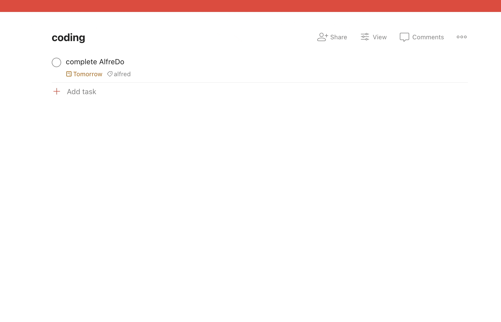
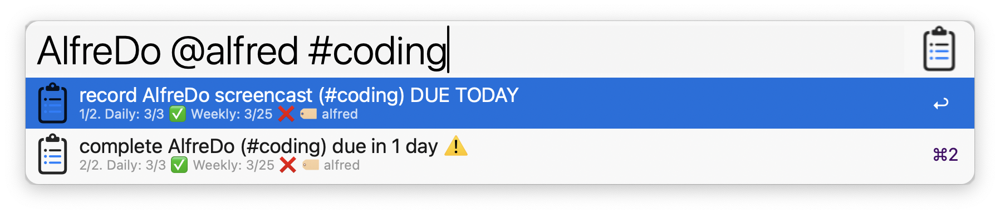
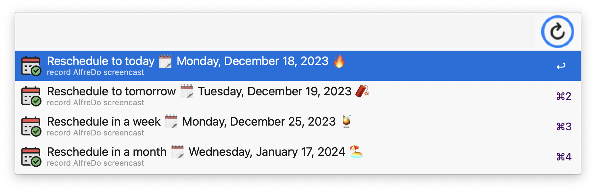
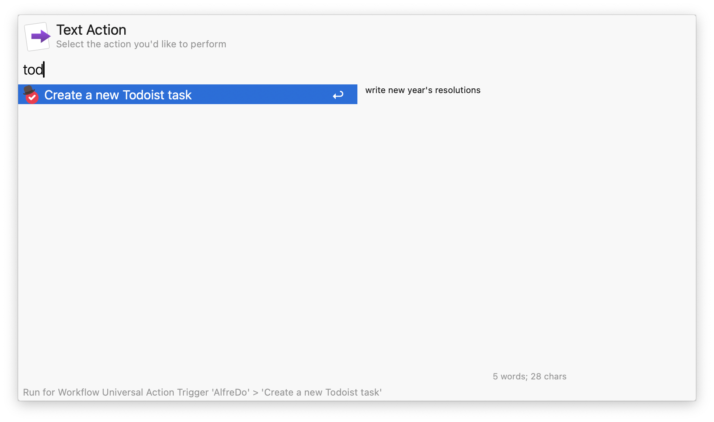

# AlfreDo
An Alfred Workflow for [Todoist](https://todoist.com/). 

NOTE: app not created by, affiliated with, or supported by Doist.

<a href="https://github.com/giovannicoppola/alfreDO/releases/latest/">
 
</a>

<!-- MarkdownTOC autolink="true" bracket="round" depth="3" autoanchor="true" -->

- [Motivation](#motivation)
- [Setting up](#setting-up)
- [Basic Usage](#usage)
- [Known Issues](#known-issues)
- [New features in version 0.5](#new-features-v05)
- [Acknowledgments](#acknowledgments)
- [Changelog](#changelog)
- [Feedback](#feedback)

<!-- /MarkdownTOC -->

<h1 id="motivation">Motivation ✅</h1>

- Quickly list, search, and act on your Todoist tasks 
- Add new tasks to Todoist through Alfred

<h1 id="setting-up">Setting up ⚙️</h1>

### Needed
- Alfred 5 with Powerpack license
- A [Todoist](https://todoist.com/) account
- Download `AlfreDo` [latest release](https://github.com/giovannicoppola/alfredo/releases/latest)

## Default settings 
- In Alfred, open the 'Configure Workflow' menu in `AlfreDo` preferences
 	- set the Todoist API token (login into your account, then generate it [here](https://todoist.com/app/settings/integrations/developer))
- *Optional*:	
	- set the keyword (or hotkey) to show: 
		1. Tasks due today (default: `!1`)
		2. Overdue (default: `!2`)
		3. All tasks (default: `!3`)
        4. Tasks with a deadline (default: `!4`)
		5. New task (default: `!!!`)
	- set the keyword (or hotkey) to force-refresh (default: `todoist::refresh`)
	- set the keyword (or hotkey) to create a new task (default: `!!!`)
	- set refresh rate (in days). Default: `1`
		- Recommended `0` (refresh every time) or `1` if you use Todoist often from browser, mobile etc. 
		- Database is automatically refreshed when a task is created, completed, or rescheduled.
		- Refresh can be forced using a keyword (default: `todoist::refresh`) or hotkey.
	- show Karma daily and weekly goals? Default: `yes`
	- partial match search? Default: `yes`. Search projects and labels anywhere in the string. Will search from start if unchecked
	- open task in Todoist app, or website

<h1 id="usage">Basic Usage 📖</h1>

## Searching your tasks 🔍
- launch with keyword or custom hotkey. You can start from 1) tasks due today, 2) tasks overdue, 3) all tasks, or 4) tasks with a deadline.

- Use multiple strings, or label/projects to refine search. Use `@` to enter one or more labels, `#` to enter a project/section. 
- Once a task is selected, you can do one of four things:
	1. `enter` ↩️ will open the task on [Todoist](https://todoist.com/) (default) or in the Todoist app, based on user preference set in `Configure Workflow`
	2. `shift-enter` ⇧↩️ will complete the task
	3. `ctrl-enter` ^↩️ will open a menu to reschedule the task. Choose one of the options, or enter a date in international format, with (`YYYY-MM-DDTHH:MM`) of without (`YYYY-MM-DD`) time, or enter a number of days. You can also use `w` or `m` after the number to enter weeks and months, respectively (e.g. `10w` will reschedule in 10 weeks)
	    - Time (in 24h format) can be added after these shortcuts as well (e.g. `7w13:13`).
	4. `alt-enter` ⌥↩️ will open the task for editing, with all current attributes pre-populated

	

## Creating new tasks ⭐
- launch with keyword (default: `!!!`) or hotkey. 
- Use: 
    - `@` to enter one or more labels (new ones can be created on the fly)
    - `#` to enter a project/section (`Inbox` will be used if none entered)
    - `p[1-4]` to enter a priority.
    - `due:` to enter a due date, As in reschedule, choose one of the options, or enter a date in international format, with (`YYYY-MM-DDTHH:MM`) of without (`YYYY-MM-DD`) time, or enter a number of days. You can also use `w` or `m` after the number to enter weeks and months, respectively (e.g. `10w` will set a due date in 10 weeks). Time (in 24h format) can be added after these shortcuts as well (e.g. `7w13:13`). Finally, you can use [natural language dates](#natural-language-dates).
- Universal Action: new tasks can be created by selecting text in any app, then launching Universal Actions and selecting `Create a new Todoist task`. 

## Database refresh 🔄
- will occur according to the rate in days set in `AlfreDo` preferences, after a task is created, completed, or rescheduled, or...
	- `todoist::refresh` to force database refresh

<h1 id="known-issues">Limitations & known issues ⚠️</h1>

- None for now, but I have not done extensive testing, let me know if you see anything!

<h1 id="acknowledgments">Acknowledgments 😀</h1>

- Thanks to the [Alfred forum](https://www.alfredforum.com) community!
- Icons from [Flaticon](https://www.flaticon.com/): 
	- https://www.flaticon.com/free-icon/overdue_6534474
	- https://www.flaticon.com/free-icon/calendar_6816638
	- https://www.flaticon.com/free-icon/project-management_4844342
	- https://www.flaticon.com/free-icon/task_2098402
	- https://www.flaticon.com/free-icon/check_10308323
	- https://www.flaticon.com/free-icon/bowler-hat_3345848
	- https://www.flaticon.com/free-icon/new_3634451
- Thanks to Werner Dijkerman for help with troubleshooting. 
	
	
<h1 id="new-features-v05">New features in version 0.5 🆕</h1>

Version 0.5 is a complete rewrite in Go, bringing several new features:

### Edit tasks ✏️
- Select a task from any query view, then press `alt-enter` ⌥↩️ to edit it
- The current task content, labels, project, priority, due date, and deadline are pre-populated in the input field
- Modify any attribute using the same syntax as task creation, then `shift-enter` ⇧↩️ to save

### Deadlines 🎯
- Set a deadline when creating or editing a task using curly braces: `{YYYY-MM-DD}`, or relative expressions like `{7d}`, `{3w}`, `{2m}`
- Natural language deadlines are also supported: `{next friday}`, `{tomorrow}`
- New **deadline query mode** to view only tasks with deadlines, sorted by closest deadline
- Deadline info is displayed in task subtitles across all query modes

<h3 id="natural-language-dates">Natural language dates 🗓️</h3>
- Due dates and deadlines support natural language expressions: `due:tomorrow`, `due:next monday`, `{in 3 weeks}`
- Inline date detection: simply type `buy milk tomorrow` or `meeting next friday at 3pm` — dates are recognized automatically from the task content
- **Multi-language support**: dates are resolved locally based on your system language (`LANG` environment variable). Supported languages: Danish, Dutch, English, Finnish, French, German, Italian, Japanese, Korean, Polish, Portuguese, Russian, Spanish, Swedish, Turkish, Chinese
- Examples: `due:domani` (Italian), `due:morgen` (German), `{demain}` (French), `nachsten freitag` (German, "next Friday")
- Multi-word expressions with "next" prefixes are supported (e.g., `prossimo venerdì`, `nächsten Freitag`, `próximo lunes`)
- Rescheduling also supports natural language input
- All dates are resolved locally to `YYYY-MM-DD` format before being sent to the Todoist API

### No more Python dependency 🐍➡️🐹
- AlfreDo now runs as a compiled Go binary — no need for Python3

<h1 id="changelog">Changelog 🧰</h1>

- 02-07-2026: version 0.5 complete rewrite in Go, new features (edit tasks, deadlines, natural language dates), and bug fixes
- 05-20-2024: version 0.4.1 bug fix
- 02-13-2024: version 0.4 new features and bug fixes (listed [here](https://github.com/giovannicoppola/AlfreDo/blob/main/changelog.md#version-04-feb-2024))
- 11-10-2023: version 0.3 support for app, bug fixes
- 06-10-2023: version 0.2.2 support for sections, international date, time, supporting spaces in project names
- 05-03-2023: version 0.1

<h1 id="feedback">Feedback 🧐</h1>

Feedback welcome! If you notice a bug, or have ideas for new features, please feel free to get in touch either here, or on the [Alfred](https://www.alfredforum.com) forum. 
